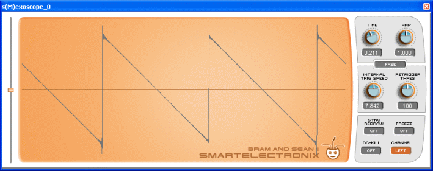
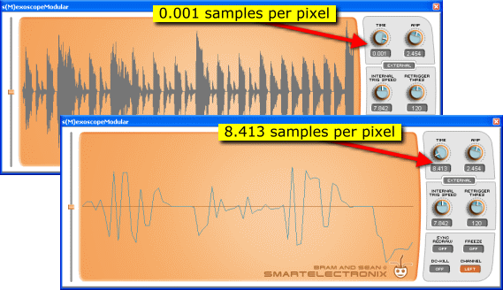
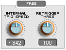
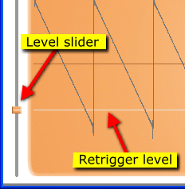
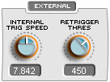
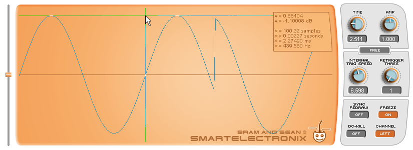

# s(M)exoscope - VST oscilloscope

s(M)exoscope is an oscilloscope VST plugin. You can use it to visually monitor audio wave forms.

Why would you do this? Well, why not? There are countless times when being able to see what your audio waveform looks like could be useful. You'll know when the time is right. For all those other times, well, it's very pretty to look at!

- [The Controls](#the-controls)
	- [Display controls](#display-controls)
	- [Retrigger modes](#retrigger-modes)
	- [External mode, and Retrigger threshold](#external-mode-and-retrigger-threshold)
	- [s(M)exoscope options](#smexoscope-options)
- [Analysis Tool](#analysis-tool)
- [The Versions](#the-versions)

## The Controls

### Display controls

Both of these knobs control the oscilloscope display.

**Time** controls the number of pixels per sample. The lower the number, the finer the resolution of the waveform. The lowest value is 31.62 pixels to draw every sample, and the highest setting is 0.001... meaning that every pixel of length represents 1000 samples.

The waveform itself will change colours to indicate if it is above or below 1 sample per pixel. At a Time of 1 or lower, a *grey* waveform display shows that more than one sample is compressed into each pixel. When Time is set higher than 1, a *blue* waveform indicates that the resolution uses more pixels to draw each sample. The figure below demonstrates the differences between extreme time settings.

**Amp** controls the amplitude of the waveform in the display. Simplicity itself: if your waveform is too thin, crank it up! Cut off at the top and bottom of the display window? Turn that amp down.

### Retrigger modes

S(M)exoscope has four modes (note that the *modular* version of the plugin has five modes. See below for more details) to determine how often it erases the display and starts drawing again (retriggers). Click the display mode button to cycle between the modes.

**Free** mode is the default, and means that the display never erases and immediately starts writing again at the left as soon as the waveform reaches the right side of the display area.

**Internal** mode retriggers the display at a frequency set by the **Internal Trig Speed** knob. Values are measured in Hz, and retrigger rates range from as infrequently as 0.441 Hz to as often as 139.4 times a second. This mode is useful if you only want to watch a certain part of a waveform.

**Rising** This mode retriggers the display every time a waveform peak rises past a certain level.

Drag the level slider (to the left of the display) to set the retrigger level above or below the zero crossing. The retrigger level is indicated by the white line.

**Falling** Identical to Rising mode, except that the display retriggers only when the waveform *falls* past the retrigger level.

### External mode, and Retrigger threshold
	

**External** is the fifth mode, available only in the modular version of s(M)exoscope. In this mode, the display retriggers whenever a *trigger* -- that is, a sample value of 1 -- is received by the plugin's trigger input. See below for more details on the modular version. 

In all modes, the **Retrigger Threshold** knob determines how soon the display can be retriggered after the last trigger. This threshold is measured in a number of samples. For example, if the Retrigger Threshold is set to 450, then the display will not retrigger unless at least 450 samples have passed through the display since the last retrigger. Useful if you absolutely need to see a certain number of samples in your waveform before it refreshes. Minimum: 1 sample, maximum: 10000 samples.

### s(M)exoscope options

There are four option buttons you can use to customize the oscilliscope's behaviour even further.

**Sync Redraw**, when activated, only updates waveform data when the plugin's internal graphic buffer is full (as opposed to in real-time). In other words, turn this on to *slow down* how often the display refreshes, and adjust the *Time* knob again to find the right speed.

**Freeze** -- self-explanatory (but here you go anyways). Click this button to freeze the waveform in the display.

**DC-Kill** -- click this button to automatically compensate for DC offset, if your waveform is too far off the zero crossing line.

**Channel** -- click this button to toggle the displayed waveform between the right and left audio channels.

## Analysis Tool

### Waveform analysis

The s(M)exoscope also contains a tool that can be used to analyze the waveform currently in the display. Based on where you place a marker, the tool analyzes the x and y dimensions of the waveform to calculate the following:

- selection amplitude (linear)
- selection amplitude (decibels)
- selection length (in samples)
- selection length (in seconds)
- selection length (in milliseconds)
- selection frequency (assuming that the selection is one cycle in length)

To use the analysis tool, just left-click anywhere on the s(M)exoscope display, and drag the pointer until you've reached the desired position. The analysis tool always measures from the beginning of the display. It's often useful to use the **Freeze** control to lock in the display first, then to measure what you see. In the example below, s(M)exoscope is measuring a simple sine wave sample, whose frequency we don't know. The display was frozen at a point where the waveform begins right at the left side of the display, and then measured to the beginning of the next cycle. The result in this case? A 440 Hz tone. Correct!

To clear the analysis, right-click anywhere on the display area.

## The Versions

### Standard or modular?

There are two versions of the oscilloscope: **s(M)exoscope** is the standard insert effect version, good to use in any VST host, and **s(M)exoscopeModular**, optimized especially for modular VST hosts like [Plogue Bidule](http://www.plogue.com/bidule/) or [AudioMulch](http://www.audiomulch.com/). The module icons from Plogue Bidule (below, left column) best illustrate the differences between the two.

The **standard** version, as mentioned before, is used as an insert effect. The plugin has stereo inputs, and audio from the track/channel on which the plugin is inserted passes through it unaltered. This version has only four retrigger modes: *free*, *internal*, *rising*, and *falling*. Basically, you should **install only this version of the plugin**, unless you are using a modular host.

The **modular** version of s(M)exoscope is identical in operation to the standard version, except for three points:

- Three sample data inputs -- the first two inputs are for stereo audio, while the third is to receive the trigger samples for the External retrigger mode.
- No audio outputs -- in a modular host, there is no need for the audio to pass through s(M)exoscope. You should already be hearing the audio through your usual monitoring channels... just draw another set of connections to a new instance of s(M)exoscope, and that's all there is to it.
- The fifth retrigger mode, External -- you can customize the modular host to send a trigger sample to the plugin's third input whenever you want the display to be retriggered. For advanced scoping of audio... Sound design geeks only need apply.
